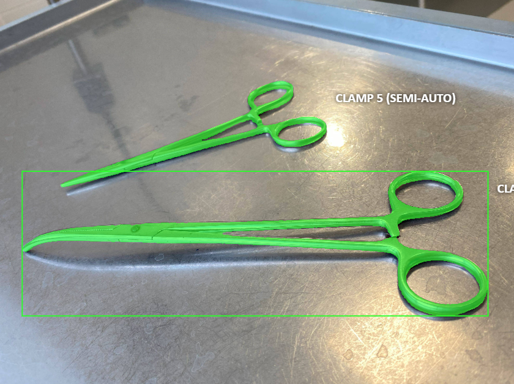

МФТИ - Прикладной анализ данных в медицинской сфере
# Surgical tools instance segmentation

Детекция хирургических инструментов методами машинного зрения

## Оглавление
[1. Описание проекта](#описание-проекта)

[2. Описание данных](#описание-данных)

[3. План работы](#план-работы)

[4. Результаты](#результаты)

[5. Выводы](#выводы)

## Описание проекта
Проект посвящен подробному описанию возможностей по полуавтоматизированной разметке самостоятельно собранных изображений и видеозаписей хирургических инструментов из гинекологического стационара г. Волгограда с использованием CVAT.ai и обучению нейронной сети YOLOv8_seg для сегментированной детекции.

### Команда 

- Алексей Сейкин
- [Дарья Курочкина](https://github.com/DariaShvetsova)
- Геннадий Музыкантов

### Цель
Сегментационная разметка собранных изображений для обучения нейронной сети в задаче классификации хирургических инструментов с демонстрацией качества распознавания инструментов.

### Задачи

1. Обосновать тему для датасета для задачи классификации
2. Собрать данные из открытых источников
3. Разметить и очистить данные (общий объем должен быть около 100 объектов)
4. *Разделить данные на обучающую и тестовую выборки
5. *Сохранить размеченные данные в формате YOLO
6. *Провести обучение YOLOv8 seg
7. *Провести тестирование YOLOv8 seg

### 1. Обоснование темы для датасета для задачи классификации
Детекция хирургических инструментов является важной задачей в медицинской практике и юридическом контроле, так как она помогает улучшить качество операций, повысить образовательный уровень медицинских специалистов и обеспечить соблюдение медицинских стандартов и протоколов.

- В кейсах с научными видео и фантомными операциями детекция инструментов позволяет:

  - `Обучение и тренировка медперсонала`: Научные видео и фантомные операции часто используются для демонстрации техник и методов хирургии. Автоматическая разметка инструментов помогает обучающимся быстрее и точнее идентифицировать инструменты и их применение.

  - `Анализ и улучшение хирургических техник`: Детекция инструментов позволяет анализировать использование различных инструментов в ходе операций, что способствует совершенствованию хирургических методик.

  - `Развитие компьютерного зрения в медицине`: Использование алгоритмов машинного обучения для анализа хирургических процедур открывает новые возможности в исследовании и практике.

- В кейсе юридического контроля правильности применения инструментов детекция важна для:

  - `Соблюдение стандартов и протоколов`: Проверка правильности использования инструментов по ходу операции для соответствия медицинским протоколам и стандартам.
  - `Фиксация ошибок и предотвращение медицинских осложнений`: Автоматическая детекция может помочь выявить ошибки в использовании инструментов, что может привести к нежелательным последствиям для пациента.
  - `Юридическая ответственность`: В случае судебных разбирательств, связанных с медицинской практикой, точная детекция инструментов может служить доказательственной базой.

Качественная разметка важна, поскольку она служит основой для обучения моделей машинного обучения. Без качественной разметки данных модель не сможет правильно идентифицировать объекты на новых изображениях.

YOLO (You Only Look Once) является одним из передовых методов для детекции объектов в реальном времени и часто используется из-за следующих преимуществ:

Скорость: YOLO может обрабатывать изображения очень быстро, что делает его идеальным для использования в реальном времени, например, во время операций.
Точность: YOLO обеспечивает хорошее сочетание скорости и точности, что критически важно для медицинских приложений.
Обучение на неполной разметке: YOLO может быть обучен даже с недостаточным количеством данных, что важно в медицинской отрасли, где размеченные данные могут быть ограничены.

## Описание данных

Датасет состоит из фото хирургических инструментов и видеозаписей их применения. Датасет собран нами самостоятельно в гинекологическом отделении ОКБ г. Волгограда.

В процессе сбора данных применялись как постановочные сцены для максимизации качества, так и непосредственные видеозаписи с хирургическими инструментами.

Общий обьем данных - 239 элементов - 1.18 Gb:
- 212 фото
- 27 видеозаписей

Исходные фото в папке `Raw` в формате .HEIC (Apple) были сконвертированы в формат .JPG и помещены в папку `converted`.

## Критерии оценки
| Этап                   | Баллы | Критерии оценивания                                                                                               |
|------------------------|------------------------------|--------------------------------------------------------------------------------------------------------------------|
| Сбор данных            | 10                           | - Датасет состоит из подходящих данных (от 100 записей) (0-5 баллов)                                               |
|                        |                              | - Есть описание собранных данных и процесса сбора (0-3 балла)                                                        |
|                        |                              | - Есть описание идеи датасета и теоретических возможностей использования датасета (0-2 балла)                     |
| Очистка данных и разметка | 10                         | - Более 50% данных подготовлены, очищены и размечены корректно (0-5 баллов)                                         |
|                        |                              | - Есть качественное, детальное описание датасета, проделанных операций, присутствующих в датасете классов (0-5 баллов) |
| Презентация            | 10                           | - Презентация цели проекта (1 балл)                                                                                 |
|                        |                              | - Презентация процесса сбора данных (1 балл)                                                                         |
|                        |                              | - Презентация методов разметки и обработки изображений (1 балл)                                                    |
|                        |                              | - Презентация полученных результатов (2 балла)                                                                      |
|                        |                              | - Качество итогового датасета: датасет содержит 100 и более записей, корректно размеченных и подготовленных к работе (0-5 баллов) |

